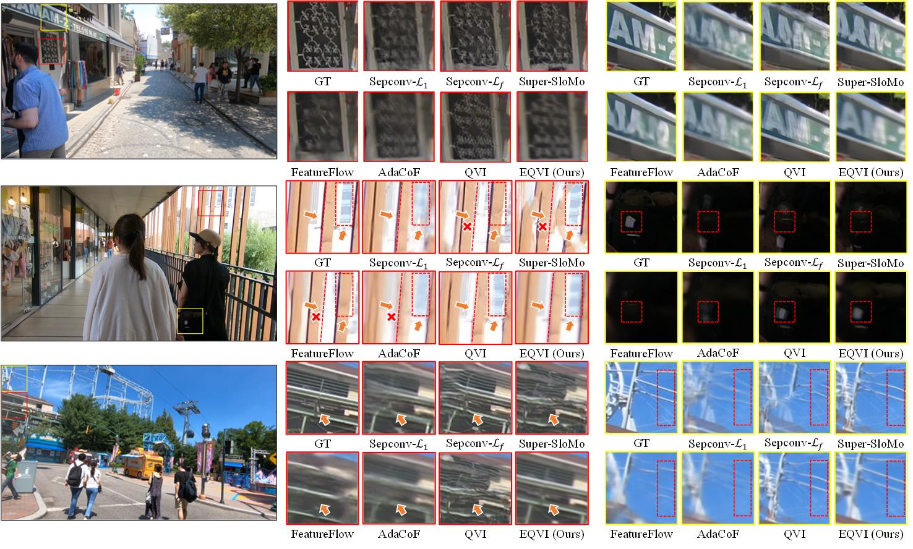

# EQVI-Enhanced Quadratic Video Interpolation
## winning solution of AIM2020 VTSR Challenge
Authors: Yihao Liu*, Liangbin Xie*, Li Siyao, Wenxiu Sun, Yu Qiao, Chao Dong  [[paper]](https://arxiv.org/pdf/2009.04642.pdf)  
*equal contribution


If you find our work is useful, please kindly cite it.
```
@InProceedings{liu2020enhanced,  
author = {Yihao Liu and Liangbin Xie and Li Siyao and Wenxiu Sun and Yu Qiao and Chao Dong},  
title = {Enhanced quadratic video interpolation},  
booktitle = {European Conference on Computer Vision Workshops},  
year = {2020},  
}
```



## News
- [2021/1/29] :zap: We have released the training codes! Please refer to the instructions.
- [2021/1/29] We provide a script `synthesize_video.py` to help synthesize video from consecutive frames. We slightly modified the file `models/scopeflow_models/IRR_PWC_V2.py`. If you can run the testing codes successfully before, you can ignore the changes. We update this file to avoid some latent problems when testing.
- [2020/10/4] We provide a new pretrained EQVI model trained with perceptual loss (VGG), namely **EQVI-P**. By adopting perceptual loss, the model can produce more visually pleasing results with sharper edges and textures, at the cost of sacrificing PSNR and SSIM values. If you care more about visual effects, we recommend you to use this model.
- [2020/10/4] According to some suggestions, we provide several sample interpolation results for reference. Specifically, we now provide two predicted results produced by EQVI and EQVI-P on REDS_VTSR validation set.

## TODO
- [x] Three pretrained models trained on REDS_VTSR dataset.
- [x] Inference script for REDS_VTSR validation and testing dataset.
- [x] Upload pretrained models to [Baidu Drive].
- [x] Provide a generic inference script for arbitrary dataset.
- [ ] Provide more pretrained models on other training datasets.
- [ ] Make a demo video.
- [x] Summarize quantitative comparisons in a Table.
- [x] Provide a script to help with synthesizing a video from given frames.
- [x] Release training codes.
  
:construction_worker: The list gose on and on...  
So many things to do, let me have a break... :see_no_evil:

## Preparation
### Dependencies
- Python >= 3.6
- Tested on PyTorch==1.2.0 (may work for other versions)
- Tested on Ubuntu 18.04.1 LTS
- NVIDIA GPU + [CUDA](https://developer.nvidia.com/cuda-downloads)

### Install correlation package
In our implementation, we use [ScopeFlow](https://github.com/avirambh/ScopeFlow) as a pretrained flow estimation module.  
Please follow the instructions to install the required correlation package:
```
cd models/scopeflow_models/correlation_package
python setup.py install
```
Note:  
if you use CUDA>=9.0, just execute the above commands straightforward;  
if you use CUDA==8.0, you need to change the folder name `correlation_package_init` into `correlation_package`, and then execute the above commands.

Please refer to [ScopeFlow](https://github.com/avirambh/ScopeFlow) and [irr](https://github.com/visinf/irr) for more information.

### Download pretrained models
- :zap: Currently we only provide EQVI models trained on REDS_VTSR dataset.
- :zap: We empirically find that the training datasets have significant influence on the performance. That is to say, there exists a large dataset bias. When
the distribution of training and testing data mismatch, the model performance could dramatically drop. Thus, the generalizability of video interpolation methods is worth investigating.

- The pretrained models can be downloaded at [Google Drive](https://drive.google.com/file/d/10BUA1ExZ5Cb_Fgetr-7chUHeXVgK9C2q/view?usp=sharing) or [Baidu Drive](https://pan.baidu.com/s/13c0xkKGUis6GJje7f5A0yw) (token: s4sv).
- Unzip the downloaded zip file.
```
unzip checkpoints.zip
```
There should be five models in the `checkpoints` folder:
- `checkpoints/scopeflow/Sintel_ft/checkpoint_best.ckpt`   
\# pretrained ScopeFlow model with Sintel finetuning (you can explore other released models of [ScopeFlow](https://github.com/avirambh/ScopeFlow))
- `checkpoints/Stage3_RCSN_RQFP/Stage3_checkpoint.ckpt`    
\# pretrained Stage3 EQVI model (RCSN + RQFP)
- `checkpoints/Stage4_MSFuion/Stage4_checkpoint.ckpt`      
\# pretrained Stage4 EQVI model (RCSN + RQFP + MS-Fusion)
- `checkpoints/Stage123_scratch/Stage123_scratch_checkpoint.ckpt`  
\# pretrained Stage123 EQVI model from scratch
- `checkpoints/Stage123_scratch_vgg/Stage123_scratch_vgg_checkpoint.ckpt`  
\# pretrained Stage123 EQVI model from scratch with adding perceptual loss.

#### Model Performance Comparison on REDS_VTSR (PSNR/SSIM)
| Model             |  baseline           | RCSN                | RQFP                 | MS-Fusion            | REDS_VTSR val (30 clips)<sup>*</sup>         |    REDS_VTSR5 (5 clips) <sup>**</sup>         |
| :----------------:| :--------------:    | :---------------:   |:-----------------:   | :------------------: | :------------------------------: | :------------------------------: |
|Stage3 RCSN+RQFP   | :white_check_mark:  | :white_check_mark:  | :white_check_mark:   |  :x:                 |     24.0354                    |      24.9633/0.7268          |
|Stage4 MS-Fusion   | :white_check_mark:  | :white_check_mark:  | :white_check_mark:   |  :white_check_mark:  |     24.0562                    |      24.9706/0.7263          |
|Stage123 scratch   | :white_check_mark:  | :white_check_mark:  | :white_check_mark:   |  :x:                 |     24.0962                    |      25.0699/0.7296          |
|Stage123 scratch vgg   | :white_check_mark:  | :white_check_mark:  | :white_check_mark:   |  :x:                 |     24.0069                    |      24.9684/0.7237          |

\* The performance is evaluated by x2 interpolation (interpolate 1 frame between two given frames).  
\** Poposed in our [[EQVI paper]](https://arxiv.org/pdf/2009.04642.pdf). Clip 002, 005, 010, 017 and 025 of REDS_VTSR validation set.
  
Clarification:
- For quantitative comparison, we recommend to use **Stage123 scratch model** (`checkpoints/Stage123_scratch/Stage123_scratch_checkpoint.ckpt`), since it achieves the best quantitative performance on REDS_VTSR validation set.
- For better visual performance, we recommend to use **Stage123 scratch vgg model** (`checkpoints/Stage123_scratch_vgg/Stage123_scratch_vgg_checkpoint.ckpt`). It can produce more visually pleasing results with sharper and clearer edges and textures.
- The **Stage3 RCSN+RQFP** and **Stage4 MS-Fusion** models are obtained during the AIM2020 VTSR Challenge via the proposed stage-wise training strategy. We adopt the stage-wise training strategy to accelerate the entire training procedure. Interestingly, after the competition, we trained a model with RCSN and RQFP equipped from scratch, and found that it functions well and even surpasses our previous models. (However, it costs much more training time.)

### Sample interpolated results
For convenient comparison, we now provide two predicted results produced by **EQVI (Stage123_scratch_checkpoint.ckpt)** and **EQVI-P (Stage123_scratch_vgg_checkpoint)** on REDS_VTSR validation set. You can download them at [Google Drive](https://drive.google.com/file/d/1ghvxcFE0PZADchEdoMeX7WUi9PKobzE7/view?usp=sharing).

### Data preparation
The REDS_VTSR training and validation dataset can be found [here](https://competitions.codalab.org/competitions/24584#participate-get-data).  
More datasets and models will be included soon.

## Quick Testing
1. Specify the inference settings  
modify `configs/config_xxx.py`, including:  
  - `testset_root` 
  - `test_size`
  - `test_crop_size`
  - `inter_frames`
  - `preserve_input`
  - `store_path`  
and etc.
 
2. Execute the following command to start inference:
  - For REDS_VTSR dataset, you could use `interpolate_REDS_VTSR.py` to produce the interpolated frames in the same naming manner. For example, given the input frames 00000000.png and 00000008.png, if we choose to interpolate 3 frames (`inter_frames=3`), then the output frames are automatically named as 00000002.png, 00000004.png and 00000006.png.
```
CUDA_VISIBLE_DEVICES=0 python interpolate_REDS_VTSR.py configs/config_xxx.py
```
Note: `interpolate_REDS_VTSR.py` is specially coded with REDS_VTSR dataset.

:zap: Now we support testing for arbitrary dataset with a generic inference script `interpolate_EQVI.py`. 
  - For other datasets, run the following command. For example, given input frames 001.png and 002.png, if we choose to interpolate 3 frames (`inter_frames=3`), then the output frames will be named as 001_0.png, 001_1.png, 001_2.png.
```
CUDA_VISIBLE_DEVICES=0 python interpolate_EQVI.py configs/config_xxx.py
```
The output results will be stored in the specified `$store_path$`.  

## Training
1. Specify the training settings in `configs/config_train_EQVI_VTSR.py`
2.  execute the following commands:  
`CUDA_VISIBLE_DEVICES=0,1,2,3 python train_EQVI_lap_l1.py --config configs/config_train_EQVI_VTSR.py`  
Note:  
(1) This will train EQVI model with equipping RCSN and RQFP from scratch. The performance is better than the results we reported in the paper.  
(2) We print training logs after each epoch, so it dose **take a while to show the logs**. Specifically, we use 4 GTX 2080Ti GPUs to train the model. About 3600s for one epoch. The training procedure lasts about 3-5 days.  
(3) The dataloader is coded with REDS_VTSR dataset. If you want to train on your own dataset, you may need to modify or rewrite the dataloader file.
